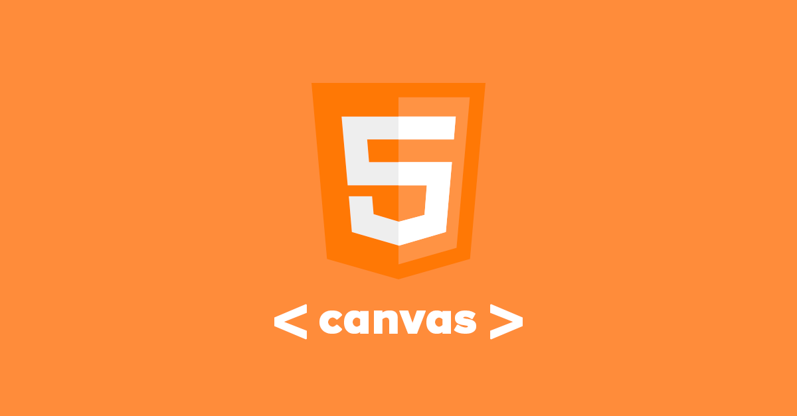

# HTML Canvas and Javascript

_September 2021_

> 🔨 From Udemy [Créez des animations javascript avec l'HTML Canvas - Enzo Ustariz](https://www.udemy.com/course/creez-des-animations-avec-lhtml-canvas).

---

<h1 align="center">
    
</h1>

## Demo on Github pages

## Overview

### Content

## Useful links

- [MDN API Canvas](https://developer.mozilla.org/fr/docs/Web/API/Canvas_API)
- [Unsplash Source](https://source.unsplash.com/)
- [CanvasRenderingContext2D.globalCompositeOperation](https://developer.mozilla.org/en-US/docs/Web/API/CanvasRenderingContext2D/globalCompositeOperation)
- [La géométrie du cercle](https://debart.pagesperso-orange.fr/ts/geometrie_cercle.html)
